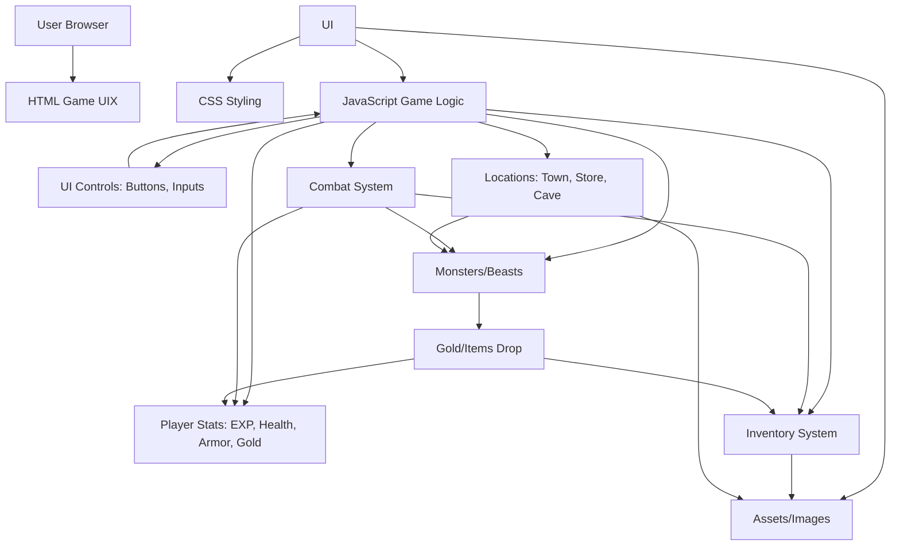

<!DOCTYPE html>
<html lang="en">
<head>
    <meta charset="UTF-8" >
    <link rel="stylesheet" src="styles.css">
    <title>RPG - FiReFeast Game</title>
</head>
<body>
    <div id="game">
        <!-- Interface for the BeAst interactions -->
      <div id="stats"> <span class="stat">EXP: <strong><span id="expText">0</span></strong></span> 
        <span class="stat">Health: <strong><span id="healthText">100</span></strong></span> 
        <span class="stat">Armor: <strong><span id="armorText">10</span></strong></span>
        <span class="stat">Gold: <strong><span id="goldText">50</span></strong></span></span>
    </div>
      <div id="controls">
        <button id="button1">Go to store</button>
        <button id="button2">Go to cave</button>
        <button id="button3">Fight FiRedragon</button>
    </div>
      <div id="BeAstStats"> 
        <span class="stat">BeAst Name: <strong><span id="monsterName"></span></strong></span>
        <span class="stat">Health: <strong><span id="monsterHealth"></span></strong></span>
    </div>
      <div id="text">
        Welcome to FiReFeast Repeller. You must defeat the FiRedragon that is preventing people from leaving the town. You are in the town square. Where do you want to go? Use the buttons above.
      </div>
    </div>
    <script src="script.js"></script>
</body>
</html>

<picture>
 <source media="(prefers-color-scheme: dark)" srcset="YOUR-DARKMODE-IMAGE">
 <source media="(prefers-color-scheme: light)" srcset="YOUR-LIGHTMODE-IMAGE">
 
</picture>

--- 
 --- 


<details open>
<summary>FRF Game Mechanics</summary>

| Rank | Features  |More+ Details |Psuedocode |
|-----:|-----------|-----------|-----------|
|     1| JavaScript| Language        | ```javascript console.log("It works! Trust me.")``` |
|     2| Python    | Language        |     ```python print(f"Hello,World!")```              |
|     3| W.K armor      |  Gain a secondary armor set  | ```var WhiteKnightArmor = armor + currArmor;```       |
|     4| D&D weaponry       |  Dragon based tools  |  ```let inventory = [];```   |
|     5| Multi hit       | Chance of weaker spread DMG      |  ```isMonsterHit() { Math.random() > .2 || health < 20; } ```  |
|     6| Revive       |  Now restart your HP with prev XP         | ``` exp = 0; health = 100;gold = 50;armor = 10; currentWeaponIndex = 0; inventory = ["stick"]; goTown()}``` |  
|     7| Repuation system  | Dont lose the people's opinion   |  NIL   |
|     8| Money glitch       |  Gain advantage after misclicking   | ``` while(numbers.length < 10) { numbers.push(Math.floor(Math.random() * 11)) }```  |
|     9| 4+ arcs       |  More locations with diff beasts        |  ```update(locations[0])``` |

</details>

---
> Let their blood rain from the sky!

— Profion 

